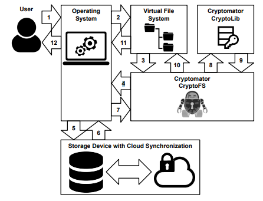
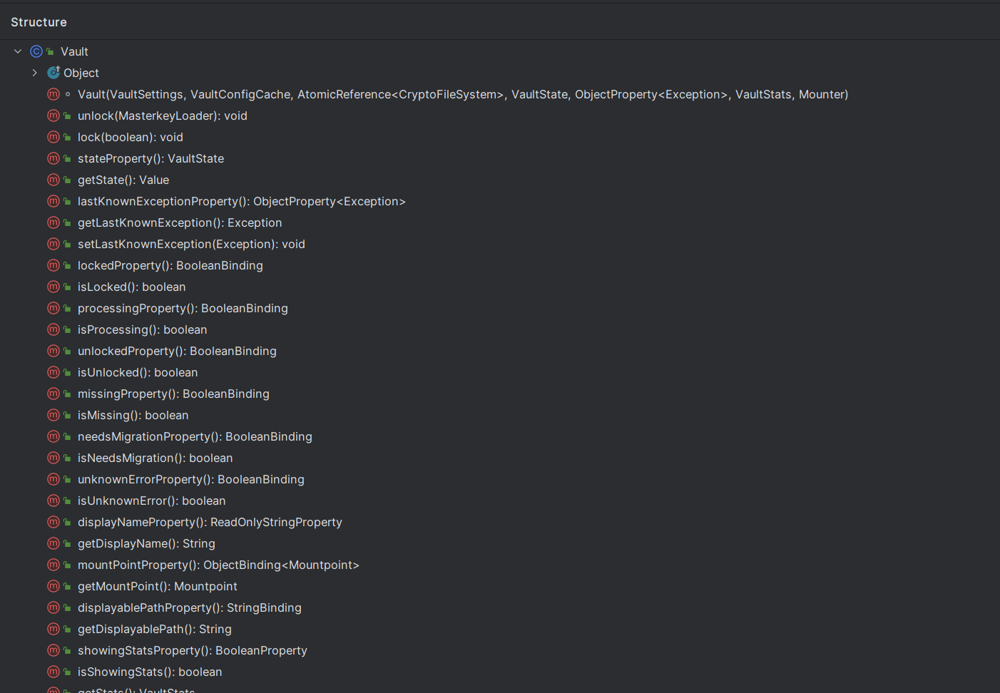
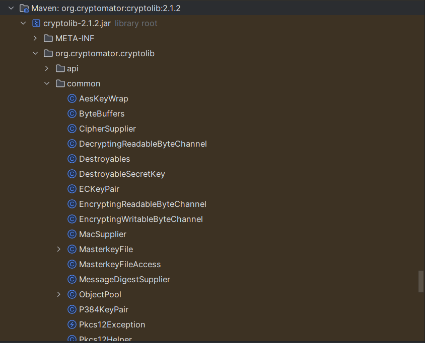
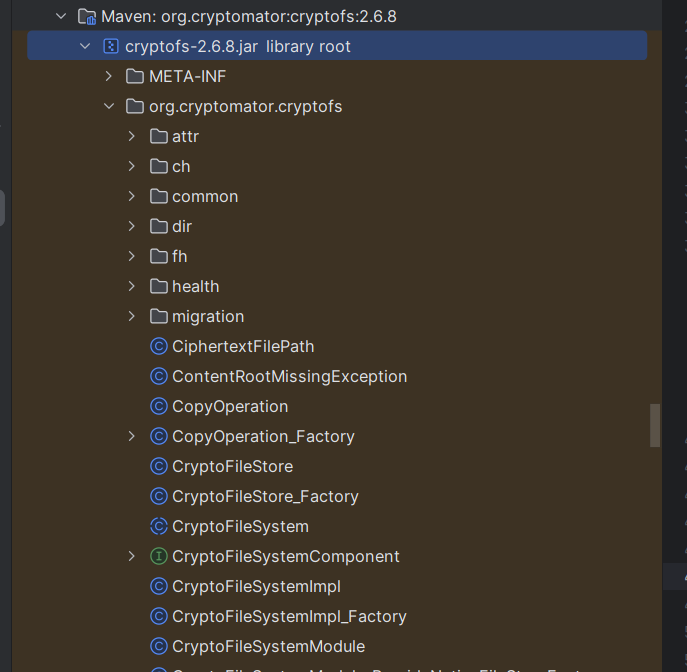

# Cryptomator代码实现分析

### 运行环境

OS: Windows 11

IDE : JetBrains IDEA

**依赖**

- JDK 21 
- Maven 3

安装目标会将项目构建并将其安装到本地Maven仓库

```
mvn clean install
# or mvn clean install -Pwin
# or mvn clean install -Pmac
# or mvn clean install -Plinux
```

### 保险库实现



Cryptomator使用了一个关键的类，名为`Vault`，用于实现保险库（Vault）的功能。能够实现负责管理加密文件系统的创建、操作和销毁，以及与用户界面的交互。



下面将讲述一些比较重要的函数和功能：

加密文件系统的创建和销毁:

`createCryptoFileSystem`方法用于创建加密文件系统。它考虑了只读模式和文件名长度限制。

```java
private CryptoFileSystem createCryptoFileSystem(MasterkeyLoader keyLoader) 
        throws IOException, MasterkeyLoadingFailedException {
    Set<FileSystemFlags> flags = EnumSet.noneOf(FileSystemFlags.class);

    // 设置文件系统为只读模式，如果在Vault设置中指定
    if (vaultSettings.usesReadOnlyMode.get()) {
        flags.add(FileSystemFlags.READONLY);
    }

    // 确定明文文件名长度限制
    if (vaultSettings.maxCleartextFilenameLength.get() == -1) {
        LOG.debug("Determining cleartext filename length limitations...");
        var checker = new FileSystemCapabilityChecker();
        int shorteningThreshold = configCache.get().allegedShorteningThreshold();
        int ciphertextLimit = checker.determineSupportedCiphertextFileNameLength(getPath());
        if (ciphertextLimit < shorteningThreshold) {
            int cleartextLimit = checker.determineSupportedCleartextFileNameLength(getPath());
            vaultSettings.maxCleartextFilenameLength.set(cleartextLimit);
        } else {
            vaultSettings.maxCleartextFilenameLength.setValue(UNLIMITED_FILENAME_LENGTH);
        }
    }

    // 记录文件名长度限制
    if (vaultSettings.maxCleartextFilenameLength.get() < UNLIMITED_FILENAME_LENGTH) {
        LOG.warn("Limiting cleartext filename length on this device to {}.", 
                 vaultSettings.maxCleartextFilenameLength.get());
    }

    // 构建加密文件系统的属性
    CryptoFileSystemProperties fsProps = CryptoFileSystemProperties.cryptoFileSystemProperties()
            .withKeyLoader(keyLoader)
            .withFlags(flags)
            .withMaxCleartextNameLength(vaultSettings.maxCleartextFilenameLength.get())
            .withVaultConfigFilename(Constants.VAULTCONFIG_FILENAME)
            .build();

    // 创建并返回新的加密文件系统
    return CryptoFileSystemProvider.newFileSystem(getPath(), fsProps);
}
```

具体来说这个函数的主要完成的任务是：

1. 设置文件系统标志：根据Vault的设置，确定是否应该以只读模式创建文件系统。
2. 确定文件名长度限制：使用`FileSystemCapabilityChecker`来确定支持的明文和密文文件名长度，并据此设置文件系统属性。
3. 构建加密文件系统属性：使用`CryptoFileSystemProperties`构建器设置密钥加载器、文件系统标志、最大明文文件名长度和保险库配置文件名。
4. 创建加密文件系统：使用`CryptoFileSystemProvider.newFileSystem`方法创建并返回一个新的加密文件系统实例。


`destroyCryptoFileSystem`方法负责关闭和清理加密文件系统。


`unlock`方法的主要任务是解锁保险库，创建加密文件系统，并将其挂载到系统上。这也是一个同步方法，确保在任何时候只有一个线程可以尝试解锁操作。

```java
public synchronized void unlock(MasterkeyLoader keyLoader) 
        throws CryptoException, IOException, MountFailedException {
    // 检查保险库是否已经解锁
    if (cryptoFileSystem.get() != null) {
        throw new IllegalStateException("Already unlocked.");
    }

    // 创建加密文件系统
    CryptoFileSystem fs = createCryptoFileSystem(keyLoader);
    boolean success = false;
    try {
        // 设置加密文件系统
        cryptoFileSystem.set(fs);

        // 获取文件系统的根目录并挂载
        var rootPath = fs.getRootDirectories().iterator().next();
        var mountHandle = mounter.mount(vaultSettings, rootPath);
        success = this.mountHandle.compareAndSet(null, mountHandle);
    } finally {
        // 如果挂载不成功，销毁加密文件系统
        if (!success) {
            destroyCryptoFileSystem();
        }
    }
}
```


`lock`方法用于锁定保险库，卸载文件系统，并销毁加密文件系统。这也是一个同步方法，以确保在执行锁定操作时不会有其他线程干扰。

```java
public synchronized void lock(boolean forced) 
        throws UnmountFailedException, IOException {
    // 获取当前的挂载句柄
    var mountHandle = this.mountHandle.get();
    if (mountHandle == null) {
        // 如果没有挂载句柄，可能已经锁定，直接返回
        return;
    }

    // 根据参数决定是否强制卸载
    if (forced && mountHandle.supportsUnmountForced()) {
        mountHandle.mountObj().unmountForced();
    } else {
        mountHandle.mountObj().unmount();
    }

    try {
        // 关闭挂载对象并执行特殊清理
        mountHandle.mountObj().close();
        mountHandle.specialCleanup().run();
    } finally {
        // 销毁加密文件系统
        destroyCryptoFileSystem();
    }

    // 清除挂载句柄并记录日志
    this.mountHandle.set(null);
    LOG.info("Locked vault '{}'", getDisplayName());
}
```

通过上面的两个函数可以看出：

在`unlock`方法中，首先检查保险库是否已经解锁，然后创建加密文件系统并尝试挂载。如果挂载成功，设置挂载句柄；如果失败，则销毁创建的文件系统。

在`lock`方法中，首先检查是否有有效的挂载句柄。如果有，根据需要执行正常或强制卸载，然后关闭挂载对象并执行任何必要的清理操作。最后，销毁加密文件系统并清除挂载句柄。

这两个方法也是Cryptomator保险库安全性的关键，确保了用户数据在加密状态下的安全存储和访问。

### **CryptoLib模块**

这个库包含了 Cryptomator 用于加密和解密操作的所有加密函数，比如说用于 AES 密钥包装和解包的`AesKeyWarp`函数。

它包括用于文件内容加密、文件名加密、密钥管理和其他加密相关任务的功能。



下面我们简单看一下`AesKeyWarp`函数的实现，其中这个类最重要的两个方法

**密钥包装方法**

```java
   /**
     * @param kek Key encrypting key
     * @param key Key to be wrapped
     * @return Wrapped key
     */
    public static byte[] wrap(DestroyableSecretKey kek, SecretKey key) {
        try (DestroyableSecretKey kekCopy = kek.copy();
             ObjectPool.Lease<Cipher> cipher = CipherSupplier.RFC3394_KEYWRAP.keyWrapCipher(kekCopy)) {
            return cipher.get().wrap(key);
        } catch (InvalidKeyException | IllegalBlockSizeException e) {
            throw new IllegalArgumentException("Unable to wrap key.", e);
        }
    }
```

这个方法用于包装一个密钥（`key`），使用另一个密钥（`kek`，即密钥加密密钥）进行加密。它使用 `CipherSupplier.RFC3394_KEYWRAP` 提供的 `Cipher` 实例来执行包装操作。

**密钥解包方法**

```java
	static DestroyableSecretKey unwrap(DestroyableSecretKey kek, byte[] wrappedKey, String wrappedKeyAlgorithm, int wrappedKeyType) throws InvalidKeyException {
		try (DestroyableSecretKey kekCopy = kek.copy();
			 ObjectPool.Lease<Cipher> cipher = CipherSupplier.RFC3394_KEYWRAP.keyUnwrapCipher(kekCopy)) {
			return DestroyableSecretKey.from(cipher.get().unwrap(wrappedKey, wrappedKeyAlgorithm, wrappedKeyType));
		} catch (NoSuchAlgorithmException e) {
			throw new IllegalArgumentException("Invalid algorithm: " + wrappedKeyAlgorithm, e);
		}
	}
```

这个方法用于解包一个已被包装的密钥（`wrappedKey`），使用密钥加密密钥（`kek`），其中`wrappedKeyAlgorithm` 参数指定了解包后的密钥应该使用的算法，并使用 `CipherSupplier.RFC3394_KEYWRAP` 提供的 `Cipher` 实例来执行解包操作。

### **CryptoFS模块**

这个模块通过提供一个透明的加密层，使得用户在操作文件时感觉就像在操作普通文件一样，而实际上这些文件是被加密存储的它负责通过操作系统在容器中读取和写入数据。

主要特点：

- 在读取操作时，它解密存储在容器中的数据，并在写入操作时对要存储的数据进行加密。
- 这确保文件在存储和检索过程中都是加密的




下面将展示如何用`cryptofs` 库来初始化和使用虚拟文件系统。

**保险库初始化**

```java
Path storageLocation = Paths.get("/home/cryptobot/vault");
Files.createDirectories(storageLocation);
Masterkey masterkey = Masterkey.generate(csprng));
MasterkeyLoader loader = ignoredUri -> masterkey.copy(); // 创建副本，因为传递给 init() 方法的密钥将被销毁
CryptoFileSystemProperties fsProps = CryptoFileSystemProperties.cryptoFileSystemProperties().withKeyLoader(loader).build();
CryptoFileSystemProvider.initialize(storageLocation, fsProps, "myKeyId");
```
可以看到它先设置了存储位置，并创建了必要的目录。然后，它生成一个主密钥并设置了一个密钥加载器。最后，使用这些参数初始化加密文件系统。


**使用 CryptoFileSystemProvider获取文件系统实例**

```java
FileSystem fileSystem = CryptoFileSystemProvider.newFileSystem(
    storageLocation,
    CryptoFileSystemProperties.cryptoFileSystemProperties()
        .withKeyLoader(ignoredUri -> masterkey.copy())
        .withFlags(FileSystemFlags.READONLY) // 只读标志当然是可选的
        .build());
```

使用 `CryptoFileSystemProvider.newFileSystem` 获取 `FileSystem` 实例，并配置与初始化阶段类似的属性

**使用构建的文件系统**

```java
try (FileSystem fileSystem = ...) { // 

    // 获取测试文件的路径
    Path testFile = fileSystem.getPath("/foo/bar/test");

    // 创建所有父目录
    Files.createDirectories(testFile.getParent());

    // 向文件写入数据
    Files.write(testFile, "test".getBytes());

    // 列出目录中的所有文件
    try (Stream<Path> listing = Files.list(testFile.getParent())) {
        listing.forEach(System.out::println);
    }

}
```
我们实现例如创建目录、向文件写入数据和列出目录中的文件等操作，这些操作在加密的文件系统上执行，意味着写入时数据自动加密，读取时数据自动解密。
