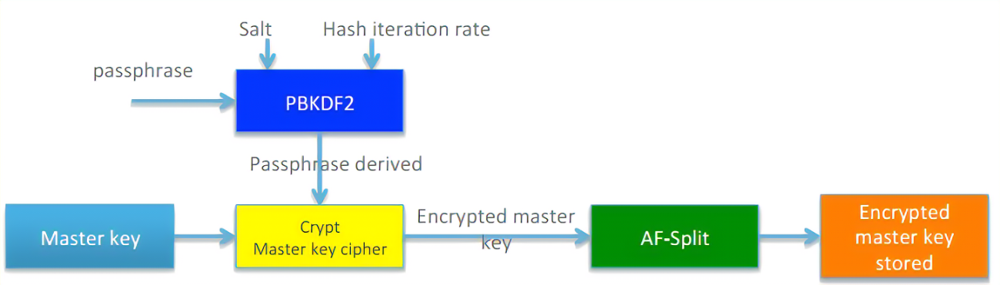
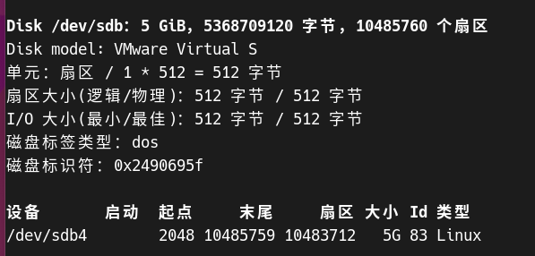
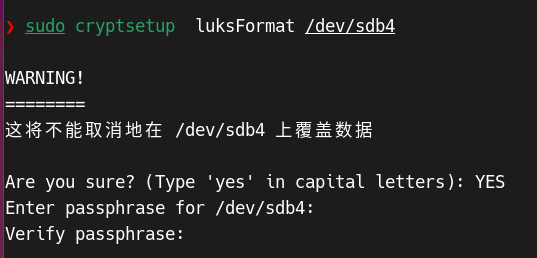
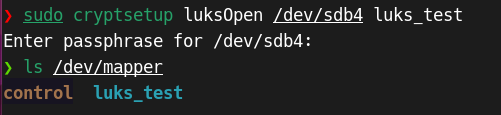
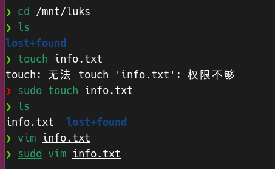
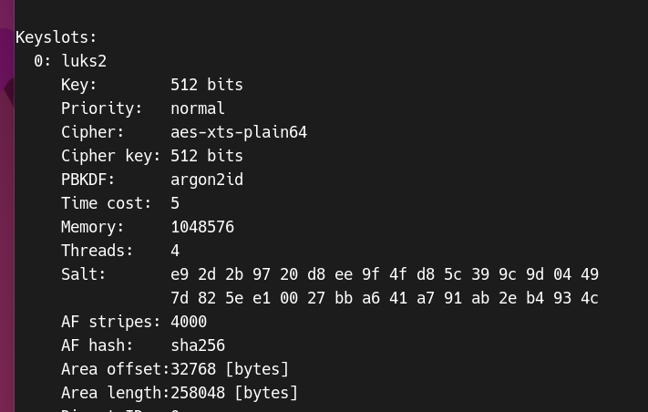

# Linux文件加密技术研究与实现


##  使用 LUKS1 加密块设备

### 概述

块加密技术伪代码

**加密数据**

```kotlin
enc−data = encrypt (cipher−name, cipher−mode, key, original, original−length)
```

参数包括指定的加密算法（`cipher−name`）和模式（`cipher−mode`），以及密钥（`key`）应用于原始数据（`original`）。`original−length` 表示原始数据的长度。加密后的数据存储在`enc−data`中。

**解密数据**

```kotlin
original = decrypt (cipher−name, cipher−mode, key, enc−data, original−length)
```


> 通过使用磁盘加密，您可以通过对其进行加密来保护块设备上的数据。要访问设备的解密内容，请输入密码短语或密钥作为验证。这对移动计算机和可移动介质非常重要，因为它有助于保护设备的内容，即使它在物理已从系统中移除。

Linux Unified Key Setup-on-disk-format (LUKS)提供了一组简化管理加密设备的工具。它作为一种==数据加密标准==具有以下特点：

- 支持多密码/用户对同一个设备的访问
- 加密密钥不依赖密码，可以改变密码而无需重新加密数据
- 采用一种数据分割技术来保存加密密钥，保证密钥的安全性

### 加密原理

#### LUKS**加密卷结构**


LUKS加密卷主要是由(分区头)LUKS phdr、密钥槽中加密秘钥秘钥材料(Key material)和加密数据区(bulk data)组成。

- phdr包含有关使用的密码、密码模式、密钥长度、uuid和主密钥校验和的信息，还有键槽的信息。

- 密钥材料是使用PBKDF2（Password-Based Key Derivation Function 2）从主密钥派生出来的，它被用于加密和解密分区的数据。密钥材料的长度取决于主密钥的长度和使用的分区加密算法。在LUKS中，密钥材料被分成多个条带（stripes），以增加安全性和抵抗反取证技术的攻击。
- 一个LUKS分区的用户密码数量和Key Slot数量一致。通常情况下Master Key长度是16或者32字节。要访问一个分区，用户只需要提供其中一个密码。如果密码被更改，则必须销毁由旧密码加密的主密钥的旧副本。


分区头部的结构如下：

**PHDR Layout:**

- `magic` (6 bytes): 用于标识LUKS分区头部的魔数。
- `version` (2 bytes): LUKS版本号。
- `cipher-name` (32 bytes): 加密算法的名称规范。
- `cipher-mode` (32 bytes): 加密模式的名称规范。
- `hash-spec` (32 bytes): 哈希函数的规范。
- `payload-offset` (4 bytes): 数据区块（bulk data）的起始偏移量，以512字节扇区为单位。
- `key-bytes` (4 bytes): 密钥的字节数。
- `mk-digest` (20 bytes): 从PBKDF2（Password-Based Key Derivation Function 2）计算得到的主密钥校验和。
- `mk-digest-salt` (32 bytes): 主密钥PBKDF2的盐参数。
- `mk-digest-iter` (4 bytes): 主密钥PBKDF2的迭代次数参数。
- `uuid` (40 bytes): 分区的UUID（唯一标识符）。
- `key-slot-1` 到 `key-slot-8` (各占48 bytes): 不同密钥槽的布局，每个密钥槽包含特定的密钥信息。

**Key Slot Layout:**

- `active` (4 bytes): 密钥槽的状态，启用或禁用。
- `iterations` (4 bytes): 用于PBKDF2的迭代次数参数。
- `salt` (32 bytes): 用于PBKDF2的盐参数。
- `key-material-offset` (4 bytes):这是密钥槽实际存储的密钥,密钥材料的起始扇区。
- `stripes` (4 bytes): 反取证信息分割的条纹数


**加密算法**

LUKS 使用的默认密码是 `aes-xts-plain64`。LUKS 的默认密钥大小为 512 字节。**Anaconda** XTS 模式的 LUKS 的默认密钥大小为 512 位。以下是可用的密码：

- 高级加密标准(AES)
- Twofish
- serpent
- cast5
- cast6


**加密模式类型**

- CBC-plain模式
- CBC-essiv:hash
- ECB-plain(电子密码本)
- XTS-plain64(根据)


**加密模式的初始化向量生成方式**

- plain
- plain64：初始化向量是扇区号的64位小端序值
- essiv
- benbi：初始向量是加密块号的64位大端序值


**Hash算法**

- **SHA-1**：SHA-1（Secure Hash Algorithm 1）是一个产生160位哈希值的密码哈希函数，目前已经不再被视为安全。
- **SHA-256**：SHA-256是SHA-2系列中的一员，产生256位哈希值。它提供了比SHA-1更高的安全性。
- **SHA-512**：SHA-512是SHA-2系列中的一员，产生512位哈希值。它提供了非常高的安全性级别。
- **RIPEMD-160**：RIPEMD-160是另一个160位的密码哈希函数，它提供了与SHA-1类似的安全性。


**Key Slot**


#### **PBKDF2**

LUKS 需要处理来自熵弱源（例如键盘输入）的密码,因此PBKDF2(PKCS #5填充)被设计用来增强熵弱密码的安全性，可以通过对干扰后的用户输入密码计算多次散列来缓和彩虹表攻击。

LUKS默认使用SHA1作为伪随机函数(PRF)，但任何其他哈希函数都可以通过设置哈希规格字段来设置。

```
result = PBKDF2(password, salt, iteration-count, derived-key-length)
```


LUKS 执行以下操作

- LUKS 对整个块设备进行加密，因此非常适合保护移动设备的内容，如可移动存储介质或笔记本电脑磁盘驱动器。
- 加密块设备的底层内容是任意的，这有助于加密交换设备。对于将特殊格式化块设备用于数据存储的某些数据库，这也很有用。
- LUKS 使用现有的设备映射器内核子系统。
- LUKS 增强了密码短语，防止字典攻击。
- LUKS 设备包含多个密钥插槽，其允许用户添加备份密钥或密码短语。


#### AF-Splitter

这种方法采用了反取证信息分割（Anti-Forensic Information Splitting）的原理，底层的扩散函数应为SHA1,其基本思想是将数据或密钥扩张分割分散存储在多个位置，并将这些部分分散存储在不同的位置或设备上，从而降低单一点的故障或攻击对整个系统的影响。

**扩散函数（Diffusion Function）**：在这里，扩散函数用符号$H$表示，通常采用SHA-1哈希函数。这个函数用于将数据混合和增加复杂性，以使其更难以逆向推导。

给定未分割的材料$D$、扩散函数$H$和条纹编号$n$，它返回了一系列的随机数$s_1, s_2, \ldots, s_n$。其中，$s_1$ 到 $s_{n-1}$ 是随机选择的，而$s_n$根据下列公式计算：

- $d_0 = 0$
- $d_k = H(d_{k-1} \oplus s_k)$
- $s_n = d_{n-1} \oplus D$

```
# 分割数据
split-material = AFsplit(unsplit-material, length, stripes)
```

- 其结果(split-material)是原始数据长度的stripes倍，即length个条纹字节。
- 需要注意，length参数是指原始内容的长度，而不是split-material数组的长度


给定分割后的材料$s_n$、扩散函数$H$和条纹编号$n$，它计算出$d_{n-1}$并从中恢复出原始的未分割材料$D$，公式为：

- $D = d_{n-1} \oplus s_n$

```kotlin
# 合并数据
unsplit-material = AFmerge(split-material, length, stripes)
```





### 加密流程


**系统初始化**

随机生成一组向量作为主密钥(Master Key),长度一般是16或者32字节

随机生成一组向量作为干扰值Salt,长度为32字节；

```
# 用户定义的主密钥长度
masterKeyLength = userDefinedLength

# 生成随机的主密钥
masterKey = generateRandomVector(length: masterKeyLength)

# 初始化头部信息
phdr.magic = LUKS_MAGIC
phdr.version = 1
phdr.cipher-name = userSuppliedCipherName
phdr.cipher-mode = userSuppliedCipherMode
phdr.key-bytes = masterKey
phdr.mk-digest-salt = generateRandomVector(length: LUKS_SALTSIZE)
phdr.mk-digest-iteration-count = userDefinedIterationCount
phdr.mk-digest = PBKDF2(masterKey, phdr.mk-digest-salt, phdr.mk-digest-iteration-count, LUKS_DIGESTSIZE)

# 计算密钥材料所占扇区数量
stripes = LUKS_STRIPES or userDefined
baseOffset = (size of phdr) / LUKS_SECTOR_SIZE + 1
keyMaterialSectors = (stripes * masterKeyLength) / LUKS_SECTOR_SIZE + 1

# 为每个密钥槽分配位置
for each key slot in phdr as ks {
    baseOffset = round_up(baseOffset, LUKS_ALIGN_KEYSLOTS)
    ks.active = LUKS_KEY_DISABLED
    ks.stripes = stripes
    ks.key-material-offset = baseOffset
    baseOffset = baseOffset + keyMaterialSectors
}

# 设置有效负载偏移和UUID
phdr.payload-offset = baseOffset
phdr.uuid = generateUUID()

# 将头部信息写入磁盘
write phdr to disk
```


### 复现和部署

安装

```shell
sudo apt-get install cryptsetup
```

格式化

```
cryptsetup  luksFormat /dev/sdb4
```



对目标设备设置加密



解密卷

使用`cryptsetup luksOpen /dev/sdb4 luks_test` ,最后一个参数指明把这个分区映射到那个名字



现在，/dev/mapper/luks_test 就是已解密的逻辑设备，可像正常设备一样对其进行操作

初始化，格式化为ext4：

```shell
mkfs.ext4 /dev/mapper/luks_test
```

创建挂载点，挂载已解密的逻辑卷：

```shell
sudo mkdir -p /mnt/luks
sudo mount /dev/mapper/luks_test /mnt/luks
```

现在可以使用lsblk以及cd /mnt/luks确认已成功挂载



加密的分区有0-7共8个密码槽（Keyslot），任意一个密码槽的密码都可用于解密分区，最初使用的cryptsetup luksFormat 占据0号密码槽

```shell
sudo cryptsetup luksDump /dev/sdb4
```



这里就显示了0号密码槽的信息，而未使用的密码槽不会被显示

### 参考文献

[1] https://wiki.archlinux.org/title/Data-at-rest_encryption

[2] https://gitlab.com/cryptsetup/cryptsetup/-/wikis/FrequentlyAskedQuestions#6-backup-and-data-recovery

[3] http://netinfo-security.org/CN/10.3969/j.issn.1671-1122.2014.09.051

[4] https://gitlab.com/cryptsetup/cryptsetup/-/wikis/LUKS-standard/on-disk-format.pdf

